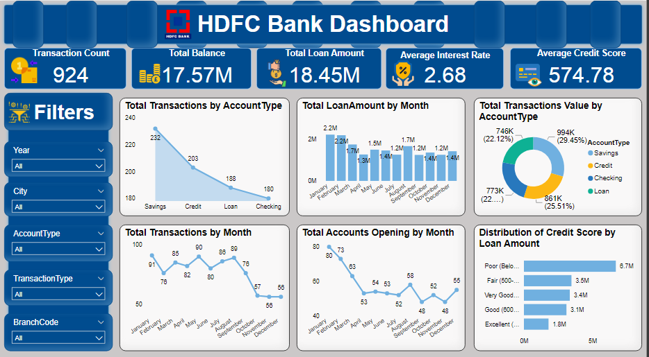

# HDFC Bank in Depth Analysis using Power BI

## Overview

This repository contains the Power BI dashboard for HDFC Bank, providing a detailed analysis of banking transactions, account balances, loan amounts, and customer credit scores. The dashboard is designed to offer insights into the bank's performance across different branches, transaction types, and customer demographics.

 

## Key Features
- **Transaction Count**: Displays the total number of transactions.
- **Total Balance**: Shows the overall account balance across all account types.
- **Total Loan Amount**: Illustrates the total loan amount disbursed by the bank.
- **Average Interest Rate**: Calculates the average interest rate across all loan accounts.
- **Average Credit Score**: Provides the average credit score of all customers.

## Part 1: Data Cleaning, Modeling, and DAX in Power BI

1. **Data Importing and Initial Examination**:
   - Imported datasets into Power BI and performed a preliminary examination.
   - Identified data quality issues and inconsistencies.

2. **Merging and Relating Datasets**:
   - Merged the datasets using a common key.
   - Ensured accuracy in the merge while retaining necessary information.

3. **Cleaning: Handling Missing and Irrelevant Data**:
   - Handled missing data, duplicate entries, and irrelevant data points.

4. **Data Type Conversion**:
   - Converted and normalized data for consistency across datasets.

5. **Categorizing Transaction Types**:
   - Created new columns categorizing transactions based on 'TransactionType'.

6. **Analysis of Account Balances**:
   - Calculated average account balances for each account type.

7. **Currency Exchange Rate Impact**:
   - Analyzed the effect of currency exchange rates on transaction amounts.

8. **Branch Activity Analysis**:
   - Identified which branch (via 'BranchCode') had the highest number of transactions.

9. **Interest Rate and Balance Correlation**:
   - Analyzed the correlation between interest rates and account balances using DAX.

10. **Loan Amount and Credit Score Relation**:
    - Examined the relationship between loan amount and credit score.

11. **Transaction Trends Over Time**:
    - Analyzed transaction trends and identified any seasonal patterns.

12. **Customer Loyalty Analysis**:
    - Calculated customer tenure from account opening to the most recent transaction.

13. **High-Value Transaction Analysis**:
    - Identified and analyzed high-value transactions.

14. **Analysis of Transaction Time Patterns**:
    - Investigated patterns based on the time of day for different transactions.

15. **Credit Score Distribution**:
    - Analyzed the distribution of credit scores among customers.

16. **Correlation Between Account Age and Balance**:
    - Explored the correlation between account age and balance.

17. **Performance Rating of Branches**:
    - Rated branches based on transaction volume and value.

18. **Extracting Key Information**:
    - Created new columns for employment sector, years at current residence, and city from 'AccountHolderDetails'.

19. **Advanced DAX: Risk Assessment Model**:
    - Developed a risk assessment model using transaction patterns, balances, and credit scores.

20. **Customer Demographics and Transaction Behavior**:
    - Analyzed transaction behavior based on customer demographics.

21. **Branch and Account Type Influence on Transactions**:
    - Investigated how branches and account types influenced transaction values.

22. **Predictive Modeling for Account Growth**:
    - Created a predictive model estimating future account growth using DAX.

23. **Data Modeling: Time Series Forecasting of Transactions**:
    - Performed time series forecasting of transaction volumes.

24. **Advanced Data Transformation: Identifying Unusual Transactions**:
    - Used Power BI to identify unusual transactions based on transaction types and values.

